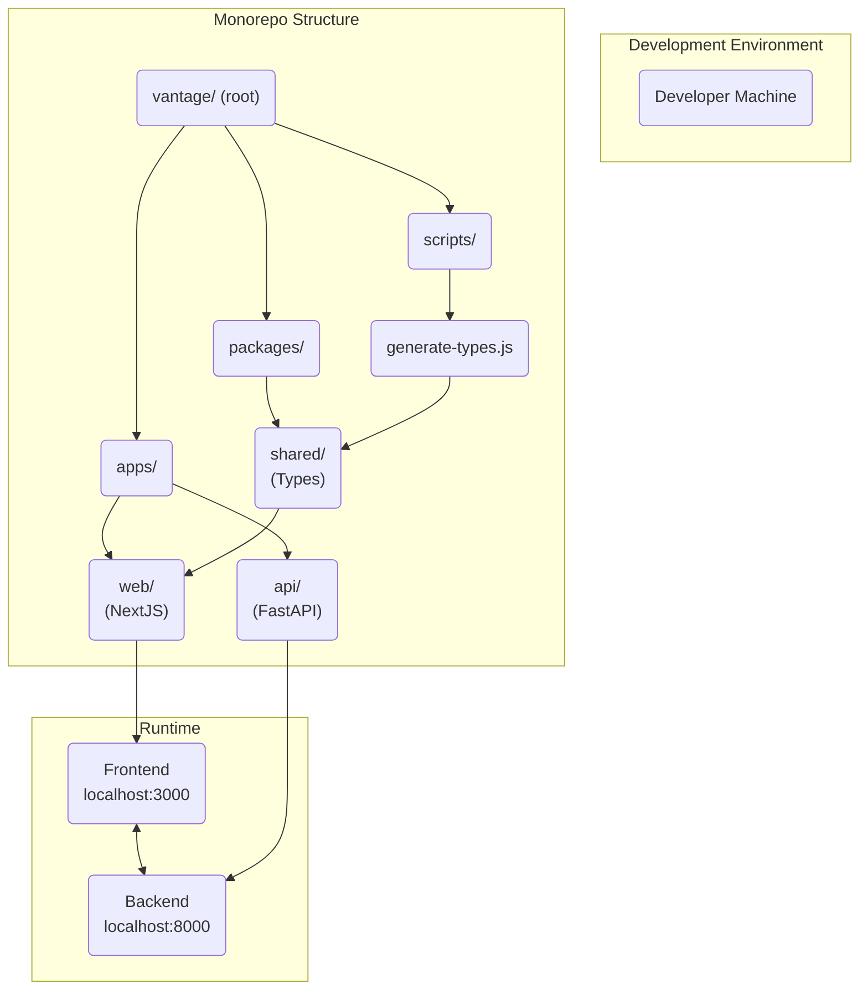
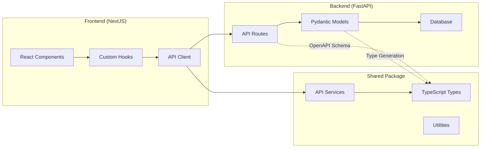

# Vantage Architecture Documentation

This document provides high-level architecture diagrams and design notes for the Vantage system.

## 🏗️ **System Architecture Overview**

## 🔄 **Type Generation Flow**

```mermaid
sequenceDiagram
    participant Dev as Developer
    participant API as FastAPI Backend
    participant Script as generate-types.js
    participant Shared as packages/shared
    participant Web as NextJS Frontend
    
    Dev->>API: 1. Define Pydantic models
    Dev->>API: 2. Tag endpoints by feature
    API->>API: 3. Generate OpenAPI schema
    Dev->>Script: 4. Run pnpm generate-types
    Script->>API: 5. Fetch /openapi.json
    Script->>Shared: 6. Generate TypeScript types
    Script->>Shared: 7. Generate API client
    Web->>Shared: 8. Import types & client
    Web->>Web: 9. Full type safety! 🎉
```

## 📊 **Data Flow Architecture**

## 🏷️ **Tag-Based Type Organization**

Our type generation uses FastAPI tags to organize code by feature domain:

| Tag | Purpose | Files Generated |
|-----|---------|----------------|
| `auth` | Authentication & authorization | `AuthService.ts`, `AuthModels.ts` |
| `users` | User management | `UsersService.ts`, `UserModels.ts` |
| `projects` | Project CRUD operations | `ProjectsService.ts`, `ProjectModels.ts` |
| `system` | Health checks, system info | `SystemService.ts`, `SystemModels.ts` |

### Benefits:
- **Maintainable:** Each domain has its own file
- **Discoverable:** Easy to find relevant types
- **Scalable:** Add new domains without affecting others
- **Type-safe:** Full TypeScript coverage

## 🛠️ **Development Workflow**

```mermaid
graph TD
    START[Start Development]
    
    START --> BACKEND[Work on Backend]
    BACKEND --> MODELS[Update Pydantic Models]
    MODELS --> ENDPOINTS[Add/Modify API Endpoints]
    ENDPOINTS --> TAGS[Tag Endpoints by Feature]
    TAGS --> GENERATE[Run: pnpm generate-types]
    
    GENERATE --> FRONTEND[Work on Frontend]
    FRONTEND --> IMPORT[Import Types from @vantage/shared]
    IMPORT --> CODE[Write Type-Safe Code]
    CODE --> TEST[Test Integration]
    
    TEST --> DEPLOY{Ready to Deploy?}
    DEPLOY -->|No| BACKEND
    DEPLOY -->|Yes| DONE[Deploy! 🚀]
```

## 🗃️ **Directory Structure Philosophy**

### **Root Level**
- **Purpose:** Monorepo coordination, shared configuration
- **Key Files:** `package.json`, `turbo.json`, `pnpm-workspace.yaml`

### **apps/web (Frontend)**
- **Structure:** NextJS App Router pattern
- **Philosophy:** Component-driven, feature-based organization
- **Imports:** Uses `@vantage/shared` for type-safe API calls

### **apps/api (Backend)** 
- **Structure:** FastAPI with domain-driven design
- **Philosophy:** Separation of concerns (models, routes, services)
- **Exports:** OpenAPI schema for type generation

### **packages/shared**
- **Purpose:** Single source of truth for types and utilities
- **Generation:** Auto-generated from FastAPI OpenAPI schema
- **Organization:** Tag-based file structure by feature domain

## 🔒 **Security Considerations**

- **Type Safety:** Prevents runtime errors from API mismatches
- **Validation:** Pydantic models provide server-side validation
- **CORS:** Configured for development environment
- **Environment Variables:** Separate configs for dev/staging/prod

## 🚀 **Deployment Strategy** 

*Note: This will be documented as we implement deployment pipelines*

## 📝 **Notes**

- All diagrams use Mermaid.js for GitHub compatibility
- Architecture supports independent scaling of frontend/backend
- Type generation keeps frontend/backend contracts in sync
- Monorepo structure enables shared tooling and consistent standards 