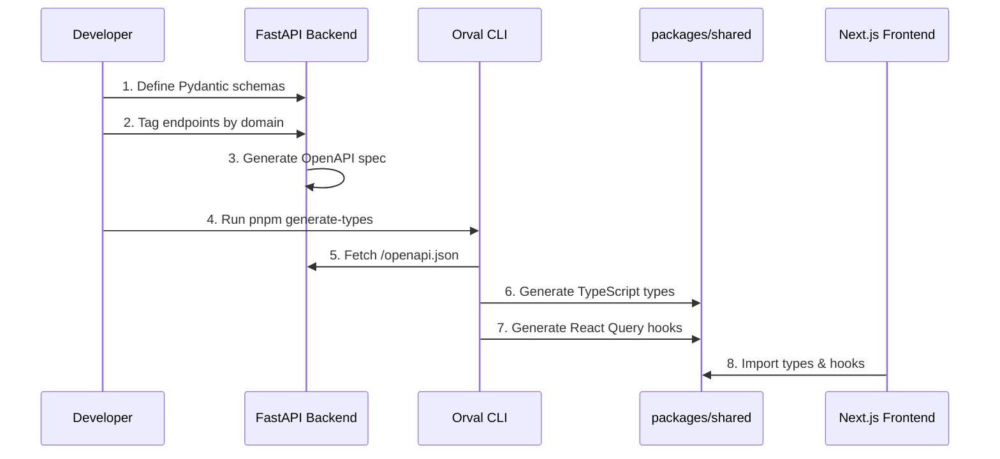

# Type Generation Workflow

> **TODO**: Document the complete type generation workflow including:
> - Why type generation is critical
> - How Orval works with FastAPI OpenAPI spec
> - Tag-based code organization
> - Generated file structure in packages/shared
> - When to run `pnpm generate-types`
> - Troubleshooting type generation issues
> - Custom type overrides (if any)

## The Type Generation Flow

## Generated Code Structure

> **TODO**: Document the structure of generated files in `packages/shared/src/generated/`

## Configuration

> **TODO**: Document orval.config.ts configuration options

## Best Practices

> **TODO**: Document best practices:
> - Always run after backend schema changes
> - Commit generated types to Git
> - Handle breaking changes
> - Custom hook wrappers
